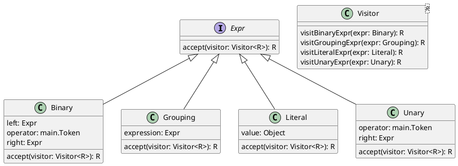

definition    → expression ;  
expression     → literal | unary | binary | grouping ;  
literal        → NUMBER | STRING | "true" | "false" | "nil" ;  
grouping       → "(" expression ")" ;  
unary          → ( "-" | "!" ) expression ;  
binary         → expression operator expression ;  
operator       → "==" | "!=" | "<" | "<=" | ">" | ">=" | "+"  | "-"  | "*" | "/" ;

### The grammar is ambiguous, so we need to resolve it by adding precedence rules.

sentence    → definition ;
definition  → assignment | letDeclaration | typeDefinition | expression ;
expression     → equality ;
equality       → comparison ( ( "!=" | "==" ) comparison )* ;
comparison     → addition ( ( ">" | ">=" | "<" | "<=" ) addition )* ;
addition       → multiplication ( ( "-" | "+" ) multiplication )* ;
multiplication → unary ( ( "/" | "*" ) unary )* ;
unary          → ( "-" | "!" ) unary | literal ;
literal        → NUMBER | STRING | "true" | "false" | "nil" | grouping ;
grouping       → "(" expression ")" ;

then we can generate an interface for nodes and each precedence level will be a class that implements this interface.

